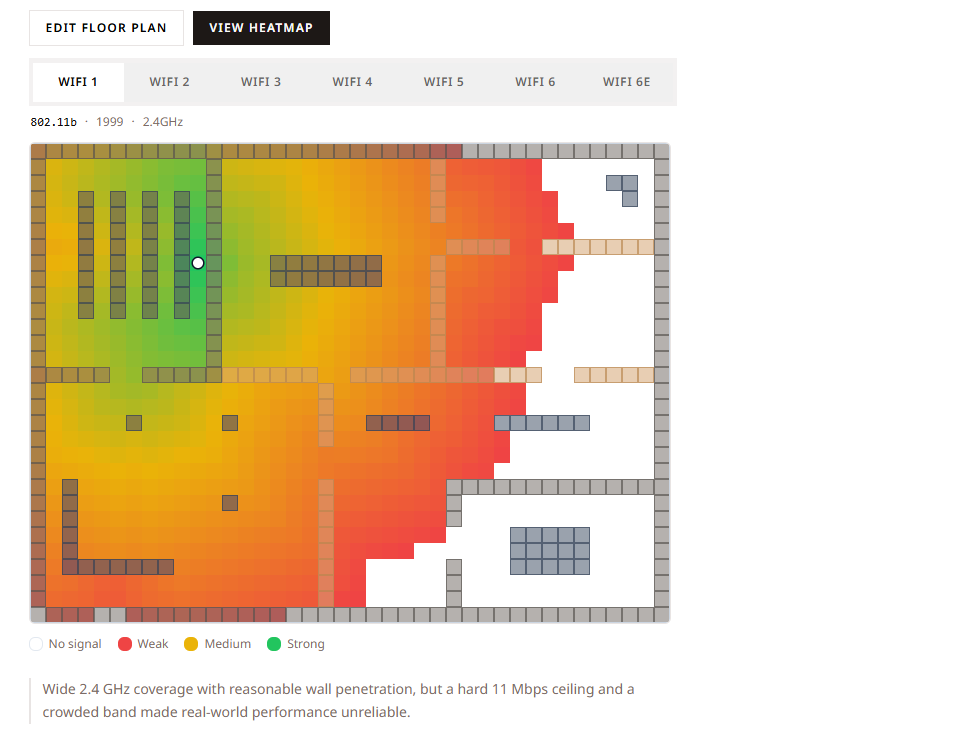
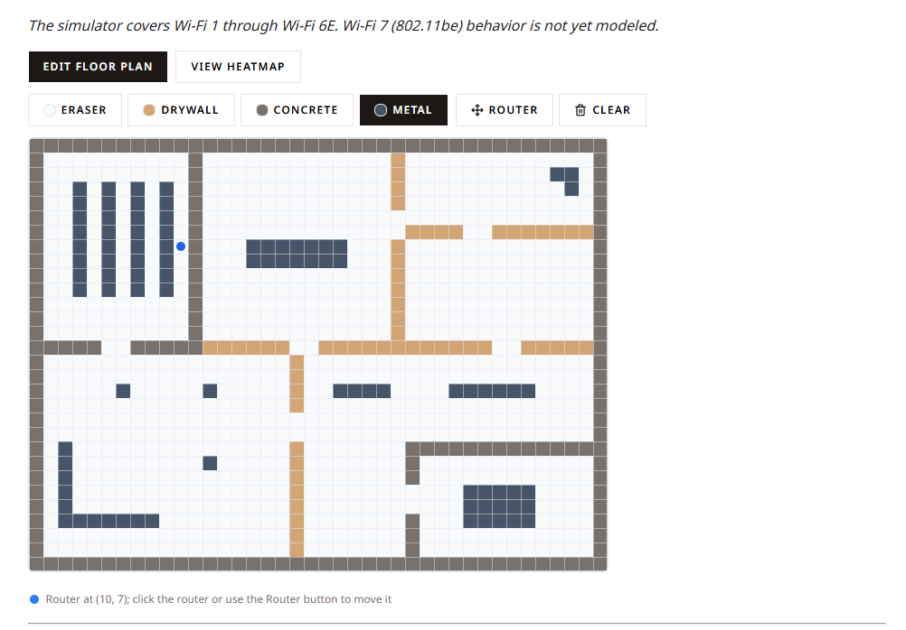

# [The Evolution of Wi-Fi](https://docs.google.com/document/d/1PpgzTTaoYTDf0LYQLVLaEKhknVlml7rv/edit?usp=sharing&ouid=118258009009741865506&rtpof=true&sd=true)

**CSARCH2 | 3rd Term 2025–2026 | S01 | Group No. 6**

> *A Hardware/Software Deep-Dive exhibit tracing the history of Wi-Fi standards from 802.11b to Wi-Fi 7.*

**Submitted by:**
- Joshua Nacasabog
- Jaica Pascual
- Nathan Trinidad
- Enzo Rosas
- Jann Miro Quilantang

---

## Table of Contents

- [Incremental Development Log](#incremental-development-log)
  - [What Was Built](#what-was-built)
  - [Aha Moments](#aha-moments)
  - [Challenges](#challenges)
  - [Creative Development](#creative-development)
- [AI Usage Declaration](#ai-usage-declaration)
- [Topic Theme](#topic-theme)
- [Background Overview](#background-overview)
- [Theme Overview](#theme-overview)
  - [Wi-Fi Generations](#wi-fi-generations)
- [Key Content Areas](#key-content-areas)
- [Tech Stack](#tech-stack)
  - [Core Technologies](#core-technologies)
  - [Interactive Elements](#interactive-elements)
- [Style Guide](#style-guide)
  - [Layout & Spacing](#layout--spacing)
  - [UI Components & Tone](#ui-components--tone)
- [Interactive Element Design](#interactive-element-design)

---

## Incremental Development Log

### What Was Built

The core deliverable for this increment is a fully functional **Wi-Fi Signal Heatmap Explorer** embedded in the exhibit page. The component is self-contained and covers the full feature loop: floor plan editing, router placement, and per-generation signal heatmap visualization.

**Component structure:**

```
src/
└── components/
    └── WifiHeatmapExplorer/
        ├── index.jsx                  <- root, useReducer, mode switching, preset grid
        ├── FloorplanEditor/
        │   ├── index.jsx              <- canvas rendering, mouse interaction
        │   ├── MaterialToolbar.jsx    <- wall brush selector, move router, clear all
        │   └── RouterMarker.jsx       <- status bar / placement prompt
        ├── HeatmapViewer/
        │   ├── index.jsx              <- heatmap canvas, legend, generation summary
        │   └── GenerationSelector.jsx <- shadcn Tabs generation switcher
        └── lib/
            ├── CellTypes.js           <- cell type constants + attenuation values
            ├── Generations.js         <- per-generation specs + descriptions
            └── Propagation.js         <- Dijkstra signal propagation + diffusion passes
```

**Exhibit page** (`src/pages/wifi-evolution.mdx`) was written from scratch with structured content covering background history, a frequency band explainer, per-standard sections with real-world vs. theoretical performance figures, and the interactive simulator at the end as a synthesis activity.

---

### Aha Moments

**shadcn/ui on Tailwind v4 needs explicit path aliases at two levels.**
`tsconfig.json` paths (`"@/*": ["./src/*"]`) handle editor tooling and type resolution, but Vite doesn't read `tsconfig.json` at bundle time. The `resolve.alias` entry in `astro.config.mjs` is what actually makes `@/components/ui/button` resolve at runtime. Both are required.

**CSS variable namespace collision.**
shadcn's generated `tailwind.css` defines variables like `--background`, `--muted`, `--border`, and `--ring` under `:root` globally. The existing `global.css` (which we cannot modify) uses some of the same variable names for the exhibit's link and text colors. shadcn's values were silently overwriting them, causing hyperlinks and text to go near-invisible across the whole site. The fix was scoping shadcn's `:root` block to `.wifi-explorer` instead — the component's root class — so the variables are only defined within the component's subtree and never reach the rest of the page.

**`client:only="react"` vs `client:load`.**
The canvas-based component uses `window` and `document` directly. Astro's default behavior tries to server-render React components before hydrating them on the client, which throws `window is not defined` during the SSR pass. `client:only="react"` skips SSR entirely for the component, which is the correct directive for anything that depends on browser APIs.

---

### Challenges

**Setup complexity for Tailwind v4 + shadcn.**
The combination of using Tailwind v4, an Astro project, a forked repo with locked files, and shadcn's own init process created a longer-than-expected setup chain. Each tool had its own requirements that weren't always compatible out of the box: Tailwind v4 needs the Vite plugin, shadcn needs the CSS entry point pointed at the right file, the path alias needs to exist in both tsconfig and Vite config, and the shadcn CSS variables need to be scoped to avoid colliding with the exhibit's existing styles.

**Working within the locked file constraints.**
`global.css`, both layout files, and the existing components were off-limits. This ruled out the most obvious solutions (import Tailwind in the layout, scope CSS in the layout) and required alternative approaches: importing `tailwind.css` from the MDX page instead, and scoping CSS variables to the component's root class rather than `:root`.

---

### Creative Development

**Dijkstra-based signal propagation instead of a radial gradient.**
The original proposal described the heatmap as "radial gradient painting that propagates outward from the router tile." The actual implementation uses a max-heap Dijkstra algorithm (`Propagation.js`) where signal strength at each cell equals the starting power minus distance falloff minus the sum of wall attenuation penalties along the best-available path. This means the signal automatically routes around walls when doing so preserves more signal than passing through them — which is physically accurate and produces a much more interesting and educational heatmap than a simple radial falloff would.

**Diffusion passes for realistic corner leakage.**
After the main Dijkstra pass, three diffusion rounds propagate a fraction of each cell's signal to its four orthogonal neighbors at a high extra cost. This prevents the hard geometric shadow artifacts that pure line-of-sight BFS produces behind every wall corner, making the result look physically plausible without being computationally expensive.

**All heatmaps precomputed on mode entry.**
When the user clicks "View Heatmap," the component immediately computes all seven generation heatmaps and caches them as `Float32Array[]` in the reducer state. Switching between generations is then an instant array index swap with no recomputation. On returning to floor plan mode, the cache is discarded entirely so re-entry always reflects the current layout.

---

## AI Usage Declaration

This project responsibly leverages artificial intelligence (AI) tools to assist during development and documentation. AI assistance was utilized in the following areas:

- **Environment & Library Setup:** Troubleshooting initial configurations and optimizing dependency setups (e.g., Astro, React, and Tailwind CSS integrations).
- **Documentation & Technical Explanations:** Simplifying complex library mechanics and breaking down official documentation frameworks.
- **Code Documentation:** Assisting in the generation of clear, inline code comments and architectural explanations.
- **Text & Copy Editing:** Refining grammar, correcting formatting typos, and improving readability across markdown and documentation files.

> **Note:** All AI-generated suggestions, configurations, and text were thoroughly reviewed, tested, and verified by the maintainer to ensure technical accuracy and project integrity.

---

## Topic Theme

**Theme:** Hardware/Software Deep-Dive

**Chosen Topic:** The Evolution of Wi-Fi

---

## Background Overview

The history of Wi-Fi technology is long and varied, depending on who you ask.

Dating back to 1980 in IBM's Rueschlikon Laboratory, Zurich, Switzerland, research on the early conceptions of the wireless local area network (WLAN) using IR technology for manufacturing floors was conducted in order to beat the then-popular wired local area networks (LAN). By 1985, the Federal Communications Commission (FCC) opened ISM frequency bands for unlicensed industrial usage with restrictions on having to use spread spectrums, laying the groundwork for the wireless communications we've come to know. In 1997, the IEEE released its first legacy 802.11 standard, and by 1999, the Wi-Fi Alliance was established, and IEEE 802.11b was released, with a 2.4 GHz band, being the first version released worldwide for commercial use. From there, each new generation of the standard brought better reliability, speeds, and range — from 11 Mbps of the 802.11b to the multi-gigabit capabilities of Wi-Fi 7 today.

Regardless of its origins, it may not be hyperbolic to say that Wi-Fi and the advent of wireless technology have helped shape our world into a more interconnected and communicative one.

---

## Theme Overview

The exhibit covers the evolution of Wi-Fi standards over the decades, from the original 802.11b in 1999 to the latest Wi-Fi 7. The exhibit aims to highlight how each generation of technology gradually improved its speed, range, and reliability in everyday environments.

### Wi-Fi Generations

| Standard | Year | Also Known As | Key Highlights |
| --- | --- | --- | --- |
| 802.11b | 1999 | Wi-Fi 1 | 2.4 GHz, 11 Mbps max, CCK modulation |
| 802.11a | 1999 | Wi-Fi 2 | 5 GHz, 54 Mbps, OFDM |
| 802.11g | 2003 | Wi-Fi 3 | 2.4 GHz, 54 Mbps, OFDM, backward compatible with 802.11b |
| 802.11n | 2009 | Wi-Fi 4 | Dual-band (2.4 + 5 GHz), MIMO introduced |
| 802.11ac | 2013 | Wi-Fi 5 | 5 GHz, gigabit speeds, MU-MIMO |
| 802.11ax | 2019 | Wi-Fi 6 | Dual-band, OFDMA, reduced subcarrier spacing, scheduled resource allocation |
| 802.11ax (6 GHz) | 2021 | Wi-Fi 6E | Adds 6 GHz band, freshest spectrum, worst wall penetration |
| 802.11be | Present | Wi-Fi 7 | Up to 46 Gbps, 320 MHz channels, Multi-Link Operation |

#### 802.11b (1999)
Also known as Wi-Fi 1, it operates on an unlicensed ISM frequency with a channel bandwidth of 22 MHz, with a maximum theoretical output of 11 Mbps and a fallback of 1-2 Mbps. It used complex M-Ary orthogonal coding known as Complementary Code Keying (CCK). It was considered ineffective because other wireless methods of the time shared the same range and caused interference in the Wi-Fi signals.

#### 802.11a (1999)
Unlike the 802.11b, this one operated on the 5 GHz band using OFDM (Orthogonal Frequency Division Multiplexing), offering speeds up to 54 Mbps. Although faster than 802.11b, it has a shorter range and less wall penetration.

#### 802.11g (2003)
Used the same OFDM tech as 802.11a, but combined both of the better qualities of 802.11a and 802.11b, offering higher speeds with broader range and backward compatibility with 802.11b.

#### 802.11n (2009)
First standard considered genuinely capable for demanding commercial environments. It combined both the 2.4 GHz and 5 GHz bands of 802.11a and 802.11b while introducing MIMO (Multiple Input Multiple Output).

#### 802.11ac (2013)
First Wi-Fi standard to provide gigabit speeds per second. Operated on the 5 GHz band and introduced wider channels and Multi-User MIMO.

#### 802.11ax - Wi-Fi 6 (2019) and Wi-Fi 6E (2021)
Wi-Fi 6 introduced dual-band support across both 2.4 GHz and 5 GHz, OFDMA, reduced subcarrier spacing (78.125 kHz), and schedule-based resource allocation. Wi-Fi 6E extended this to the 6 GHz band, adding up to 1,200 MHz of fresh, uncongested spectrum.

#### 802.11be (Present)
Also known as Wi-Fi 7, it is backwards compatible with Wi-Fi 6E, uses OFDMA, operates across all three bands (2.4, 5, and 6 GHz), supports up to 46 Gbps, introduces 320 MHz channels, and Multi-Link Operation (MLO).

---

## Key Content Areas

The exhibit covers the following content areas:

- **Frequency Bands** and what they mean (2.4 GHz vs 5 GHz vs 6 GHz tradeoffs)
- **How Wi-Fi shaped the information age**
- **Per-generation comparison:** 802.11b to 802.11be
- **Real-world vs. theoretical performance** per standard
- **Interactive signal propagation simulator**

---

## Tech Stack

### Core Technologies

| Category | Technology |
| --- | --- |
| Framework | Astro 6 |
| Runtime | Node.js 26 |
| Content Format | `.mdx` (Markdown Extended) |
| Component Language | React (`.jsx` for authored components, `.tsx` for shadcn/ui generated files) |
| Version Control | GitHub (forked from provided template) |
| CSS Framework | TailwindCSS v4 (via `@tailwindcss/vite` Vite plugin) |
| UI Components | shadcn/ui (Sera preset) |
| Icons | Lucide Icons |
| State Management | `useReducer` (React built-in) |

### Interactive Elements

#### Wi-Fi Floor Plan Simulator

A 2D floor plan editor where users paint wall materials onto a grid, place a router, and toggle a signal strength heatmap. The heatmap updates when the user switches between Wi-Fi generations, visually demonstrating how different standards handle range, frequency, and obstacle penetration.

**The Grid**

The floor plan is a tile-based rectangular grid (40x30 cells) rendered top-down on a `<canvas>` element. Each cell represents approximately one square meter. Users paint cells by clicking or click-dragging.

**Paintable Cell Types**

| Cell Type | Signal Effect |
| --- | --- |
| Empty space | Distance falloff only |
| Drywall (interior wall) | -3 dB attenuation |
| Concrete (exterior wall) | -12 dB attenuation |
| Metal appliance | -20 dB attenuation |

**Router Placement**

A router marker is displayed on the grid. Users click the router (or the Router button in the toolbar) to enter placement mode, then click any empty cell to move it. The router cannot be placed on a wall cell.

**Heatmap Mode**

Clicking "View Heatmap" precomputes signal heatmaps for all seven generations simultaneously using a Dijkstra-based propagation algorithm. Signal at each cell is calculated as:

```
signal = maxStrength - (distanceCost x distance) - sum(wallAttenuation x wallPenetration)
```

Switching between generations is an instant cache lookup with no recomputation. Returning to floor plan mode discards the cache.

| Color | Signal Strength |
| --- | --- |
| Green | Strong signal |
| Yellow | Moderate signal |
| Red | Weak signal |
| White | No signal / dead zone |

**Wi-Fi Generation Switcher**

A tab strip above the heatmap lets users cycle through seven generations:

```
WiFi 1 (802.11b) -> WiFi 2 (802.11a) -> WiFi 3 (802.11g) -> WiFi 4 (802.11n) -> WiFi 5 (802.11ac) -> WiFi 6 (802.11ax) -> WiFi 6E
```

Selecting a generation updates the heatmap canvas and displays a short summary description of that generation's signal characteristics. WiFi 7 (802.11be) is covered in the exhibit text but not yet modeled in the simulator.

---

## Style Guide

### Layout & Spacing

The exhibit uses a clean, article-style layout with the Wi-Fi simulator placed at the end of the page as a synthesis activity — after the background history, frequency band explainer, and per-standard sections. The simulator itself uses a two-mode interface: Edit Floor Plan (default) and View Heatmap. Controls are grouped in a toolbar above the canvas. The heatmap legend and generation summary sit below the canvas.

### UI Components & Tone

The main UI component is the `WifiHeatmapExplorer`, which uses shadcn/ui (Sera preset) for all buttons and tabs. The Sera preset was chosen for its sharp, non-rounded aesthetic which suits a technical instrument-style tool.

**Edit Floor Plan mode:**
- Toolbar with wall material brush buttons (Drywall, Concrete, Metal, Eraser), a Router placement button, and a Clear All button
- Canvas with `cursor-crosshair` for painting and `cursor-pointer` when hovering the router
- Status bar that becomes an amber callout banner during router placement mode

**View Heatmap mode:**
- shadcn Tabs generation selector spanning the canvas width
- Detail row showing the selected generation's IEEE standard, year, and frequency band
- Canvas rendering the signal heatmap with wall overlays
- Color legend and one-line generation summary below

---

## Interactive Element Design

### Figure 1 - Wi-Fi Heatmap View (802.11b)



> *The Simulator tab showing the heatmap overlay for 802.11b.*

### Figure 2 - Floor Plan Builder



> *The Simulator tab showing the floor plan builder.*